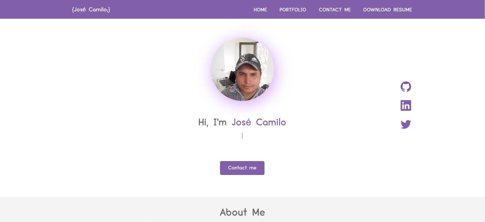

# Portfolio Personal

Aquí utilizo HTML y CSS puro, además utilizo django mientras lo sigo estudiando, sólo en el formulario de contacto utilizo Bootstrap. Más adelante me gustaria utilizar React en el front.  

### https://portfolio-django-production-614b.up.railway.app/